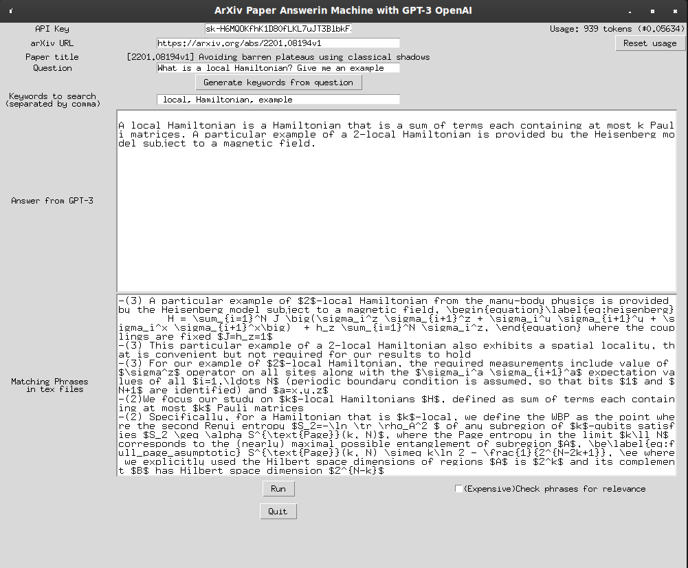

# PaperGenie

# API KEY 
To use the program, you need an API key from OpenAI. You can create a free account at https://beta.openai.com/, which will give you 18$ to try it out for hundreds of trials. Once you have an account, you can create/find your APIKEY under Personal->View API Keys.
You can then paste it in the program and save it in a local API.txt file to retrieve it automatically at later usage.

# Libraries
You  need to install the openai and bs4 libraries: `pip install openai bs4`
also tkinter, sudo apt-get install python-tk
Tested on python 3.9

# Run and Usage

To run the program, simply run the command: python UI.py.

The tool downloads both the PDF and tar.gz containing the source files from arxiv.org. This includes the .tex file.
You can either ask the engine to search for keywords based on the question prompted, or insert/add keywords yourself. 
These will be searched for in the paper`s tex file and the matching phrases used to inquire the question to the GPT3 engine.
An estimate of the cost incurred is provided, alongside the counts of token usage.

Example:

